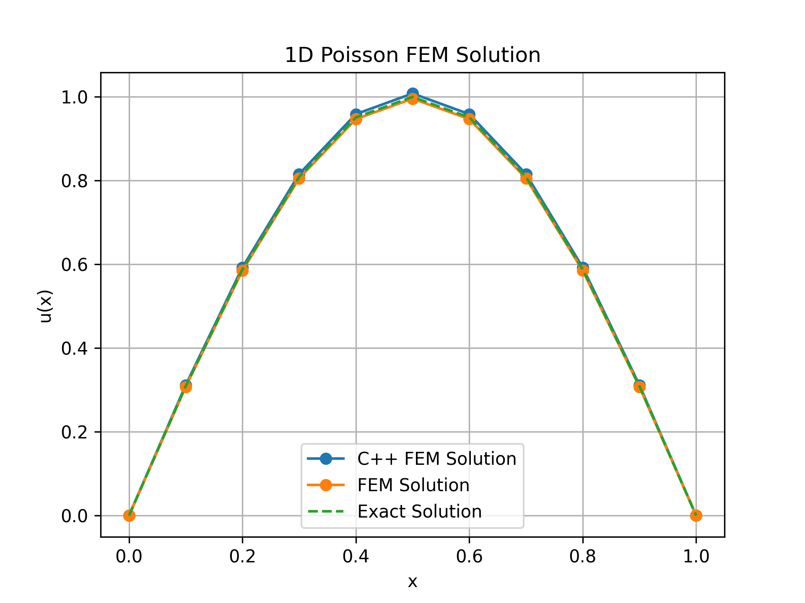

# 1D Poisson Equation using Finite Element Method (FEM)

In this section, we solve the 1D Poisson equation using the Finite Element Method from scratch in Python (using only NumPy and SciPy) and C++.

We solve:

$$
-\frac{d^2u}{dx^2} = f, \quad x \in (0, 1)
$$

in domain $\Omega$ with boundaries $\partial\Omega = \Gamma_D \cup \Gamma_N$ and $\empty = \Gamma_D \cap \Gamma_N$. That is, in order to properly solve this problem, we require Dirichlet and Neumann conditions. For a first problem we start with only DIrichlet BCs, so $\partial\Omega = \Gamma_D$.

Dirichlet boundary conditions: $u(0) = u(1) = 0$ and source term $f = f(x) = \pi^2 \sin(\pi x)$. This case, specifically, has the analytical solution $u(x) = \sin(\pi x)$. But you are probably wondering:

> Why would I need to solve an equation for a problem I know the answer beforehand?

This is called a `manufactured solution`. In this case, we know that the described problem - with the prescribed boundary conditions - have analytical solution. For this specific case, we can measure the exact error between the approximate solution using a numerical method and the analytical solution of the problem. [This text by Mathcube on Medium](https://medium.com/@mathcube7/the-method-of-manufactured-solutions-13e8c12b8500) describes in further detail the importance of manufactured solutions in numerical methods.

## Weak form

First thing to be done is to derive the weak form of the equation. We have:

1. Multiply the whole equation by an arbitrary function $w = w(x)$ and integrate for the whole domain $\Omega$:
$$
- \int_\Omega (\dfrac{d^2}{dx^2} u) w dx = \int_\Omega f w dx
$$

2. Apply the divergence theorem to reduce the continuity requirements of $u$ and to allow for easier Neumann boundary conditions application:

$$
- \int_\Omega (\dfrac{d^2}{dx^2} u) w dx = \int_\Omega f w dx \\
\int_\Omega \dfrac{du}{dx}  \cdot \dfrac{dw}{dx} dx - \int_{\partial\Omega} \frac{\partial u}{\partial n}wds = \int_\Omega f w dx 
$$

where: 

$$
\int_{\partial_n} \dfrac{\partial u}{\partial n} w ds = \int_{\Gamma_D} \dfrac{\partial u}{\partial n} w ds + \int_{\Gamma_N} \dfrac{\partial u}{\partial n} w ds
$$

3. Define the function spaces to be used for test and trial functions:

$$
\mathcal{V} = \{ w_h \in H^1( \Omega) : w_h = u_0\text{ on }\Gamma_D\} \\
\mathcal{\hat{V}} = \{ w_h \in H^1( \Omega) : w_h = 0\text{ on }\Gamma_D\} 
$$

That is, for $w_D = 0$ on $\Gamma_D$, the boundary term becomes: 

$$
\int_{\partial_n} \dfrac{\partial u}{\partial n} w ds = \int_{\Gamma_N} \dfrac{\partial u}{\partial n} w ds
$$

4. Finally, our problem becomes: Find $u_h \in \mathcal{V}_h \subset \mathcal{V} $ such that:

$$
\int_\Omega \dfrac{d u_h}{d x} \cdot \dfrac{d w_h}{d x} dx = \int_\Omega f w_h dx + \int_{\Gamma_n} gw_hds \quad \forall w_h \in \mathcal{\hat{V}}_h \subset \mathcal{\hat{V}}
$$

## Now we can finally start coding!

First, we need a mesh to define our function spaces into. Let's start with a two elements mesh: 
 

Notice that the mesh contains two elements: E0 and E1 and three nodes: N0, N1 and N2. The nodes are the points where we will evaluate our function $u_h$ and the elements are the intervals between the nodes. The elements are defined by their nodes, so E0 is defined by N0 and N1 and E1 is defined by N1 and N2. For this problem, we use piecewise linear functions, so we will use linear shape functions. That is:

$$
N_i(x) = 1 \text{   if } x \in [x_i, x_{i+1}] \\
N_i(x) = 0 \text{    if } x \notin [x_i, x_{i+1}] \\
$$

For this problem, the shape functions are defined as:
$$
N_0(x) = \frac{x_1 - x}{x_1 - x_0} \\
N_1(x) = \frac{x - x_0}{x_1 - x_0} \\
N_2(x) = \frac{x_2 - x}{x_2 - x_1} \\
N_3(x) = \frac{x - x_1}{x_2 - x_1}
$$

Where $x_0$, $x_1$ and $x_2$ are the nodes of the mesh. The shape functions are defined in such a way that they are equal to 1 at their corresponding node and 0 at the other nodes. For example, $N_0(x)$ is equal to 1 at node N0 and 0 at nodes N1 and N2. The shape functions are used to interpolate the solution $u_h$ in each element. For example, in element E0, we have:

